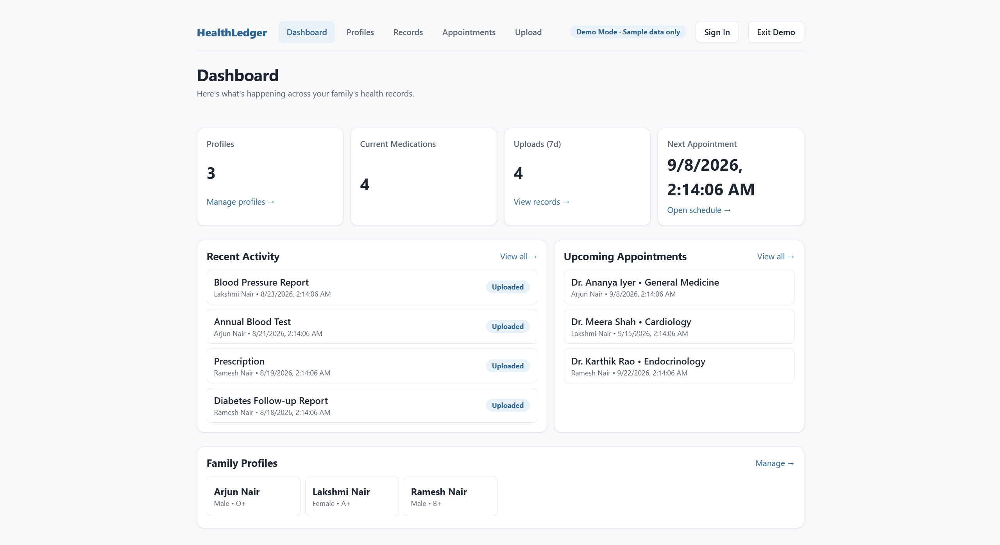
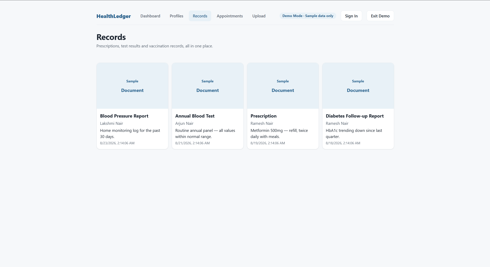

# HealthLedger

A full-stack family health records platform for managing profiles, medications, appointments, and medical documents with secure user-scoped access.

---

## Live Demo

- Frontend: https://healthledger-surya.vercel.app

> Use **View Demo** on the login page to explore a read-only sample workspace without creating an account.

---

## Overview

HealthLedger is a full-stack web application that allows users to manage health information for multiple family members from a single account.

Each family profile can have its own medications, appointments, and medical records. The React frontend communicates with an Express REST API, MongoDB stores structured application data, and Cloudinary stores uploaded medical documents.

The backend handles authentication, validation, ownership checks, resource-level authorization, and file-storage coordination so each user's family data remains isolated from other authenticated users.

---

## Features

- Email/password authentication with JWT
- Multiple family health profiles per account
- Medication tracking
- Appointment scheduling and tracking
- Medical record and document uploads
- Dashboard with health activity summaries
- Ownership-scoped access to profiles and child resources
- Read-only demo mode with fictional sample data
- Responsive frontend interface
- Cloudinary-backed file storage
- Cascade cleanup for profile-associated resources and uploaded assets

---

## Tech Stack

### Frontend

React, React Router, Axios, CSS

### Backend

Node.js, Express.js, MongoDB, Mongoose, JWT, bcrypt, express-validator, Multer, Helmet, Morgan

### Infrastructure

MongoDB Atlas, Cloudinary, Vercel, Render

---

## Architecture

```text
                    ┌─────────────────┐
                    │ React Frontend  │
                    │     Vercel      │
                    └────────┬────────┘
                             │
                         REST / HTTPS
                             │
                             ▼
                    ┌─────────────────┐
                    │ Express REST API│
                    │     Render      │
                    ├─────────────────┤
                    │ JWT Auth        │
                    │ Validation      │
                    │ Authorization   │
                    │ Controllers     │
                    └───────┬─────────┘
                            │
                 ┌──────────┴──────────┐
                 │                     │
                 ▼                     ▼
        ┌─────────────────┐    ┌─────────────────┐
        │ MongoDB Atlas   │    │   Cloudinary    │
        │ Structured Data │    │ Uploaded Files  │
        └─────────────────┘    └─────────────────┘
```
---

## Screenshots

### Login & Demo Access

Use **View Demo** to explore HealthLedger without creating an account.


### Demo Dashboard

A populated family health dashboard showing profiles, medications, recent records, and upcoming appointments.



### Medical Records

Read-only sample medical records associated with fictional family profiles.



---
## Engineering Highlights

- JWT-based authentication with separate ownership-based authorization
- Profile-scoped access control across medications, appointments, and medical records
- Validated REST APIs with explicit field whitelisting
- Backend-mediated document uploads using Multer and Cloudinary
- Compensating cleanup when Cloudinary succeeds but a MongoDB write fails
- Cascade deletion of profile-associated resources and uploaded assets
- Read-only demo mode that keeps real authenticated data completely separate

---

## Deployment

Frontend: Vercel  
Backend: Render  
Database: MongoDB Atlas  
File Storage: Cloudinary  

Live Application: https://healthledger-surya.vercel.app

---

## Author

Built by [Surya Kalimuthu](https://github.com/SuryaK5125)
